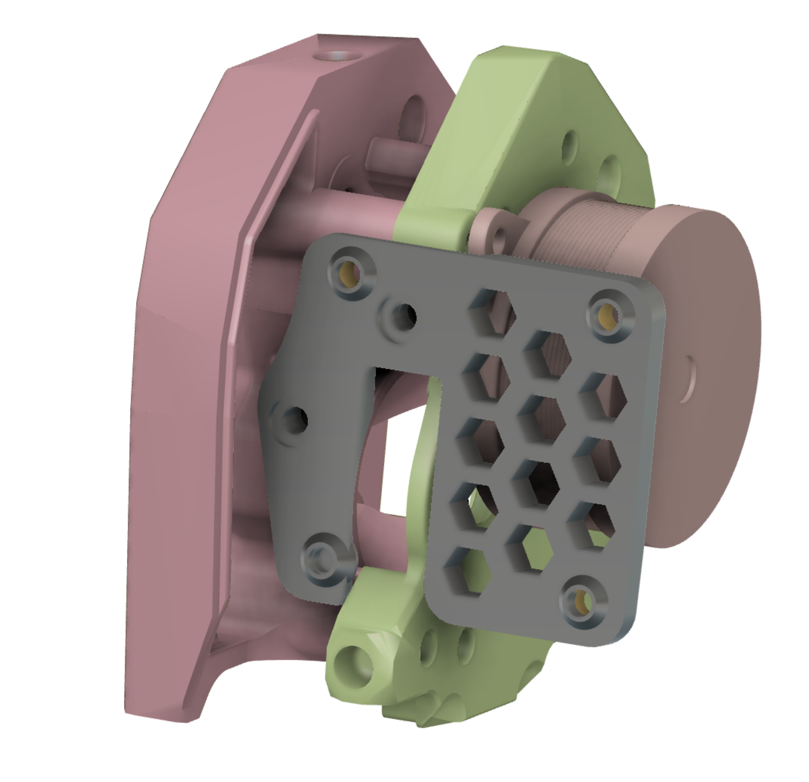
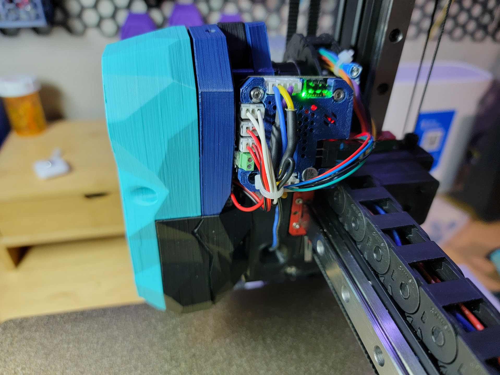
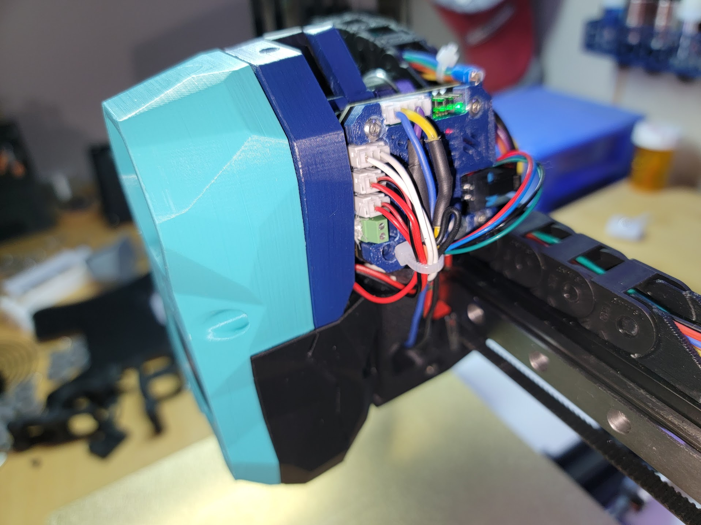
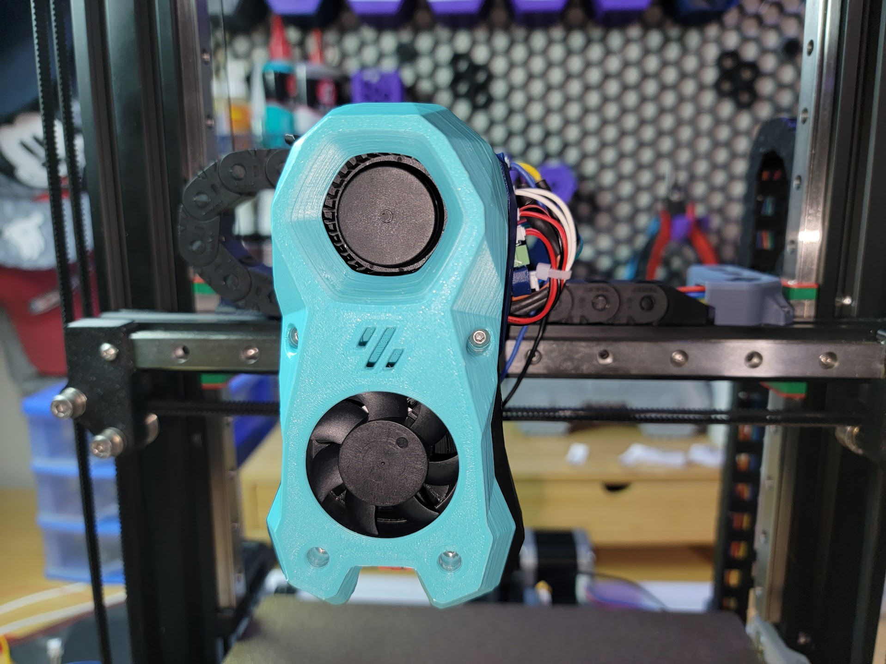

# Huvud Side Mount for Clockwork2/Stealthburner

I'm a big fan of the [Huvud toolhead board](https://github.com/bondus/KlipperToolboard) board, and wanted to adapt it to the Voron Stealthburner/Clockwork2 as beta came to a close.
This was very relevant to my Ender 3 Pro converted to a Voron Switchwire, as it is extremely cramped for space for wiring underneath. The Huvud toolhead board allowed me to eliminate most of the toolhead wiring, both reducing the cable load in the cable chain (more fluid movement allowed) and considerably less wiring underneath.

### Pros:

* LEDs on the Huvud board are very visible
* 4 wires in the cable chain to the toolhead (unless you want LEDs in SB)

### Cons: 

* You will not be able to utilize the Stealthburner cable cover
* Wires on the Huvud board will be exposed on the toolhead
* No cramped routing/cables under the SB cable cover

## Installation

### Before Install

* Be sure you have heatsets on the gear side of CW2, the bracket bolts to the two unused heatsets (the cable cover heatset is not used).
* I recommend installing the thermistor wires before mounting, it's pretty much impossible to manipulate them once installed.
* Note orientation in the photos: the Microfit3 connector should point toward the rear for ease of routing the 4 input wires from the mainboard/cable chain.

Install heatsets in the three corners. The fourth corner can have a bolt lightly holding onto the plastic, but there is not room for a heatset. I'm only using three bolts and it's solid.

Once the bracket is bolted on to CW2, pass 3xM3-12mm (probably 8mm if not using cover by eddietheengineer as pictured) bolts through the Huvud board, slip the spacers over the bolts (small tip of the cone should point toward the Huvud board). Then bolt the three corners to the heatsets on the brackets.

